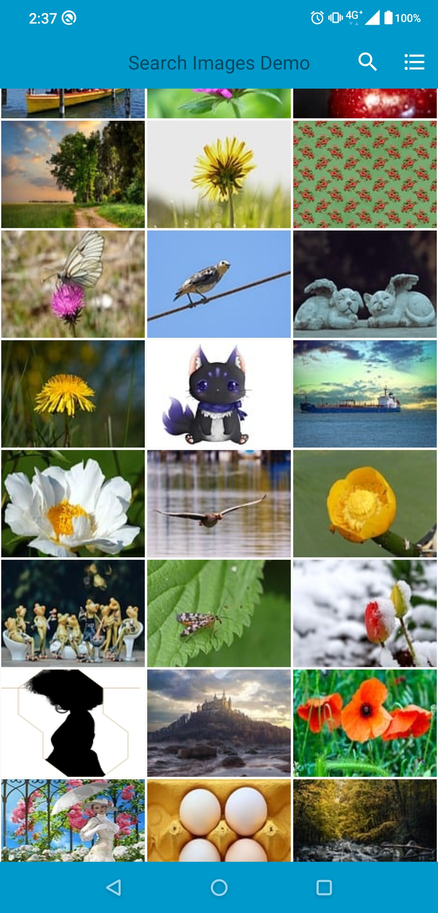

# SearchImagsDemo
語言: kotlin  
架構: MVVM  
Network: [Retrofit + Okhttp](https://github.com/Neil-Tsai/android-network)  
## Third Party Libs  
   [BaseRecyclerViewAdapterHelper](https://github.com/CymChad/BaseRecyclerViewAdapterHelper)  
   [immersionbar](https://github.com/gyf-dev/ImmersionBar)  
   [glide](https://github.com/bumptech/glide)  
   [logger](https://github.com/orhanobut/logger)    
   [materialsearchview](https://github.com/Mauker1/MaterialSearchView/tree/milestone/2_0)    
   [SpinKit](https://github.com/ybq/Android-SpinKit)
# 

  

